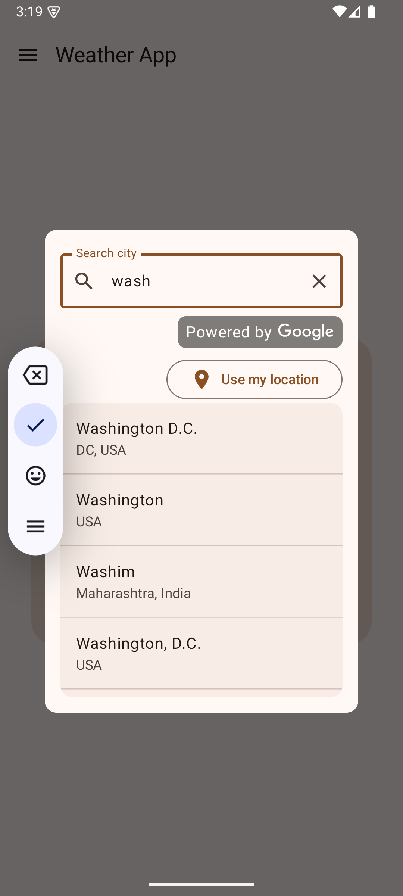

<div align="center">

# WeatherApp

<!-- Badges row -->
[](https://github.com/gago852/WeatherApp/actions/workflows/gradle-test.yml)
[](https://github.com/gago852/WeatherApp/blob/main/LICENSE)
[](https://kotlinlang.org/)
[](https://developer.android.com/jetpack/compose)
[](https://github.com/gago852/WeatherApp/pulls)
[](https://github.com/gago852/WeatherApp/issues)

Android weather application built with Kotlin, Jetpack Compose, MVVM, and modern Android tooling. It provides current weather, multi‑day forecast, and location search (Google Places Autocomplete) with a clean, accessible UI.

</div>

---

## Features

- Current weather by GPS or selected city
- 5–7 day forecast with key metrics
- City search overlay with debounce and Google Places Autocomplete
- Add city by current GPS location (permission-aware)
- Favorite cities management
- Light/Dark theme (Material 3)
- Offline caching and periodic refresh
- Error and loading states with accessible feedback

## Tech Stack

- Language: Kotlin
- UI: Jetpack Compose (Material 3)
- Architecture: MVVM, unidirectional data flow, state hoisting
- DI: Hilt
- Networking: Retrofit + OkHttp
- Concurrency: Kotlin Coroutines & Flow
- Local persistence: Room
- Image loading: Glide (or Coil, depending on module usage)
- Testing: JUnit, Espresso/Compose Testing, Mockito, Hamcrest
- APIs: OpenWeatherMap API, Google Places API (Autocomplete + Details)

## Architecture Overview

The project follows Clean Architecture with clear separation of concerns:

- `domain/`: business models, use cases, and interfaces
- `data/`: repositories, remote sources (OpenWeather/Places), local sources (Room)
- `ui/`: Compose screens, navigation, and theming
- `di/`: Hilt modules

Compose best practices are applied per internal guidelines (recomposition minimization, `derivedStateOf`, modifier ordering, previews, and accessibility). Performance guidance includes lazy collections, proper keys, lifecycle awareness, and memory management.

## Project Structure

```
app/
  src/
    main/
      java/com/gago/weatherapp/
        data/
          datastore/
          location/
          remote/
          repository/
        domain/
          location/
          model/
          repository/
          utils/
        ui/
          main/
          navigation/
          settings/
          theme/
          utils/
        di/
      res/
        values/
        drawable/
        mipmap/
    test/
    androidTest/
```

## Search Overlay (Places Autocomplete)

- Overlay with `OutlinedTextField` (debounced input of ~200ms)
- Shows up to 5 results with city and country
- Selecting a result fetches coordinates (Places Details) and then weather (OpenWeather)
- Includes a "Use my location" button when a GPS city isn’t already saved
- Accessibility: labels, content descriptions, TalkBack support
- Legal: Google attribution visible and clickable (terms of service)

## Getting Started

### Prerequisites

- Android Studio Jellyfish+ (or latest stable)
- JDK 17+
- Android SDK with latest Compose/Material dependencies
- OpenWeatherMap API key
- Google Places API key (Places API and Maps SDK for Android enabled)

### Configuration

This project uses the Google Maps Platform Secrets Gradle Plugin to manage secrets.

1) Plugin configuration in `app/build.gradle.kts` (already present):

```kotlin
android {
    // ...
    secrets {
        propertiesFileName = "secrets.properties"
        defaultPropertiesFileName = "local.defaults.properties"
    }
}
```

2) Create a `secrets.properties` file at the project root based on the provided template `local.defaults.properties`:

```
# secrets.properties (DO NOT COMMIT)
PLACES_API_KEY=YOUR_PLACES_API_KEY
API_KEY=YOUR_OPENWEATHER_API_KEY
```

The repository includes `local.defaults.properties` as a template:

```
PLACES_API_KEY=DEFAULT_API_KEY
API_KEY=DEFAULT_API_KEY
```

3) (Optional) Flavor-specific overrides
   - You can create files like `debug.properties`, `release.properties`, etc., at the project root to override values per flavor/buildType. Example:

```
# release.properties
PLACES_API_KEY=YOUR_PRODUCTION_PLACES_API_KEY
API_KEY=YOUR_PRODUCTION_OPENWEATHER_API_KEY
```

4) Referencing secrets
   - AndroidManifest (example for Google Places/Maps):

```xml
<!-- AndroidManifest.xml -->
<application>
    <meta-data
        android:name="com.google.android.geo.API_KEY"
        android:value="${PLACES_API_KEY}" />
</application>
```
   - In code (Kotlin):

```kotlin
val openWeatherKey = BuildConfig.OPENWEATHER_API_KEY
```

Notes:
- Do not commit `secrets.properties`, `debug.properties`, `release.properties`.
- Keep `local.defaults.properties` committed as a safe template for collaborators.

### Build & Run

1. Open the project in Android Studio
2. Sync Gradle
3. Run on a device/emulator with Google Play Services
4. Grant location permission when prompted for GPS features

### Testing

- Unit tests for ViewModels/UseCases (coroutines test dispatchers)
- UI tests with Compose Testing
- Use fakes for repositories and API layers

From Android Studio: Run the `test` and `androidTest` configurations, or via Gradle tasks.

## Screenshots

<!-- Add screenshots to a dedicated folder and reference them below. Example structure:

```
docs/
  screenshots/
    welcome_screen.png
    main_screen.png
    overlay_screen.png
``` -->

<!-- Then embed them in this section: -->

<p align="center">
  &nbsp;&nbsp;
  &nbsp;&nbsp;
  
  
</p>

<!-- > Tip: Use relative paths so screenshots render correctly on GitHub. -->

<!--
## Badges (reference only)

Use shields.io to add badges. Replace placeholders with your repo/user names:

```


```

Place the badges under the title at the top of this README for best visibility.
-->

## Localization

The project supports i18n for UI strings (e.g., `values/`, `values-es/`, `values-fr/`). Ensure new strings are added to all relevant locales.

## Attributions & Legal

- Weather data by [OpenWeather](https://openweathermap.org/)
- Places Autocomplete by [Google Places API](https://developers.google.com/maps/documentation/places/web-service/overview)
- Display "Powered by Google" attribution as required by Google Maps Platform terms

## Roadmap

- Improved offline mode and cache policies
- Widgets and notifications
- More units and localization options
- Enhanced accessibility audits

## Contributing

Pull requests are welcome. Please follow the code style and testing guidelines. Ensure new UI follows Material 3 and accessibility best practices.

## License

This project is licensed under the MIT License. See the `LICENSE` file for details.

